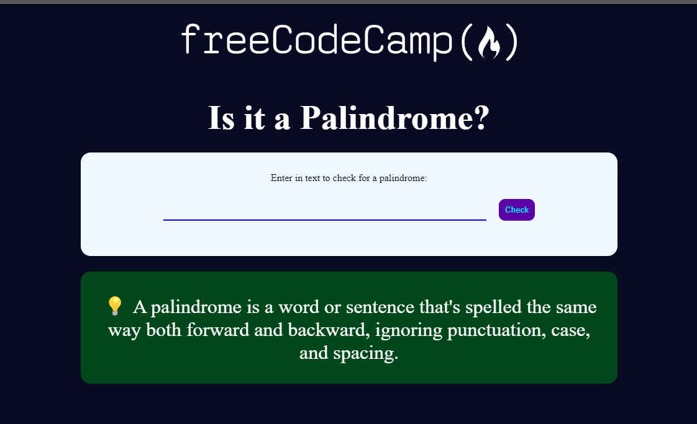

# FreecodeCamp - plaindrome-checker solution

This is a solution to the [Build a Palindrome Checker](https://www.freecodecamp.org/learn/javascript-algorithms-and-data-structures-v8/build-a-palindrome-checker-project/build-a-palindrome-checker). Frontend Mentor challenges help you improve your coding skills by building realistic projects.

## Table of contents

- [Overview](#overview)
  - [The challenge](#the-challenge)
  - [Screenshot](#screenshot)
  - [Links](#links)
- [My process](#my-process)
  - [Built with](#built-with)
- [Author](#author)

## Overview

### The challenge

A palindrome is a word or phrase that can be read the same way forwards and backwards, ignoring punctuation, case, and spacing.

Note: You'll need to remove all non-alphanumeric characters (punctuation, spaces and symbols) and turn everything into the same case (lower or upper case) in order to check for palindromes.

### Screenshot

### Links

- Live Site URL: [Todo App](https://todo-app-mohamedagina.vercel.app/)

## My process

### Built with

- Semantic HTML5 markup
- CSS
- js

## Author

- Frontend Mentor - [@mohamedagina](https://www.frontendmentor.io/profile/mohamedagina)
- LinkedIn - [@mohamedagina](https://www.linkedin.com/in/mohamed-agina/)
